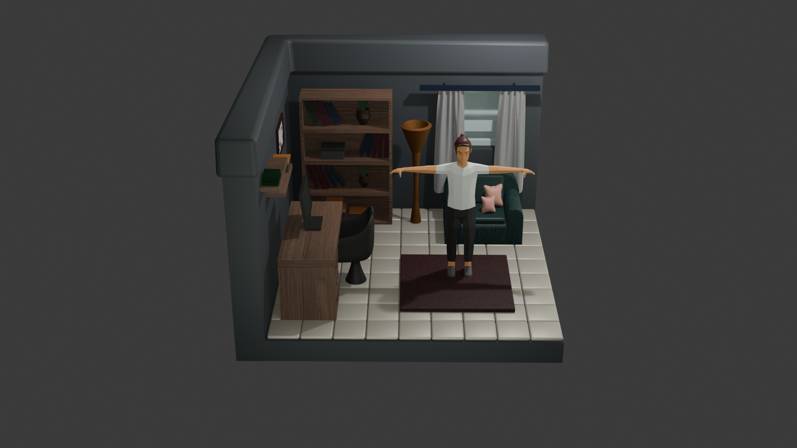
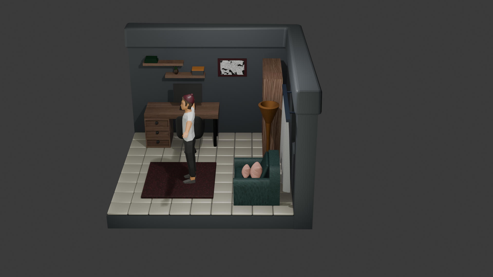
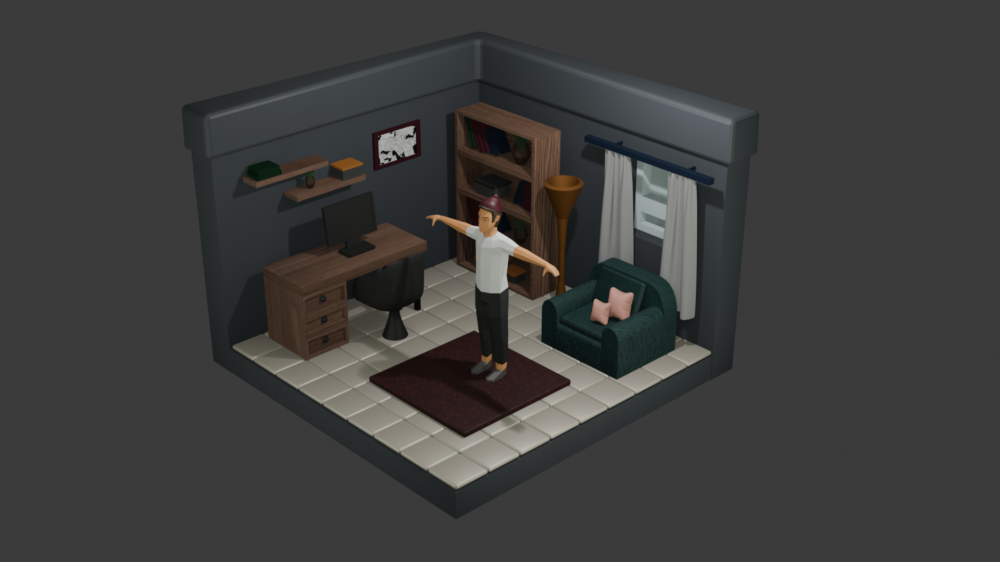

# Gamer Room 3D Design and Character Animation

Blender kullanılarak geliştirilen bir 3D oyun odası tasarımı, iç mekan modelleme, karakter modelleme, rigging ve animasyon projesidir.

## Proje Hakkında

Bu projede modern bir oyun odasının üç boyutlu modeli ve görsel tasarımı Blender kullanılarak oluşturulmuştur.

Çalışma kapsamında mekanın genel yerleşimi, mobilyalar, oyun ekipmanları, dekoratif objeler, malzemeler, aydınlatma ve karakter modeli üzerinde çalışılmıştır.

Projeye ek olarak karakter rigging ve animasyon çalışmaları gerçekleştirilmiş, karakter armature sistemi kullanılarak hareketlendirilmiştir.

Projenin amacı, sınırlı bir iç mekan içerisinde işlevsel ve görsel açıdan dengeli bir oyun alanı oluşturmanın yanı sıra karakter modelleme ve animasyon süreçlerini uygulamalı olarak gerçekleştirmektir.

## Proje Özellikleri

- 3D oyun odası modelleme
- İç mekan tasarımı
- Mobilya modelleme ve yerleşimi
- Oyun ekipmanı modelleme
- Karakter modelleme
- Karakter rigging
- Armature kurulumu
- Kemik hiyerarşisi oluşturma
- Karakterin sahne içerisinde konumlandırılması
- Karakter animasyonu
- Keyframe tabanlı animasyon
- Dekoratif obje modelleme
- Malzeme ve yüzey çalışmaları
- Aydınlatma düzenlemeleri
- Kamera konumlandırması
- 3D görselleştirme
- Final render çalışmaları

## Kullanılan Teknoloji

- Blender

## Proje Dosyaları

### Oyun Odası Projesi

[ EcemOzen_GamerRoom1.blend ](EcemOzen_GamerRoom1.blend)

### Karakter Animasyon Projesi

[ Ecem_Ozen_Animasyon.blend ](Ecem_Ozen_Animasyon.blend)

## Final Renderlar

### Render 1

### Render 2

### Render 3

## Karakter Rigging ve Animasyon

Projede yer alan karakter Blender armature sistemi kullanılarak riglenmiş ve animasyona hazırlanmıştır.

Çalışma kapsamında:

- Armature oluşturulması
- Kemik yapısının kurulması
- Karakter ile armature ilişkilendirilmesi
- Karakter pozlarının oluşturulması
- Keyframe animasyonlarının uygulanması
- Karakter hareketlerinin düzenlenmesi

işlemleri gerçekleştirilmiştir.

## Kullanım

`.blend` dosyaları Blender ile açılarak modellemeler, karakter rigging yapısı, animasyonlar, malzemeler, kamera, aydınlatma ve sahne düzenlemeleri incelenebilir.

## Geliştirici

### Ecem Özen

Computer Engineering Student

Zonguldak Bülent Ecevit University

## Lisans

Bu proje eğitim, portföy ve 3D tasarım çalışmaları amacıyla hazırlanmıştır.
